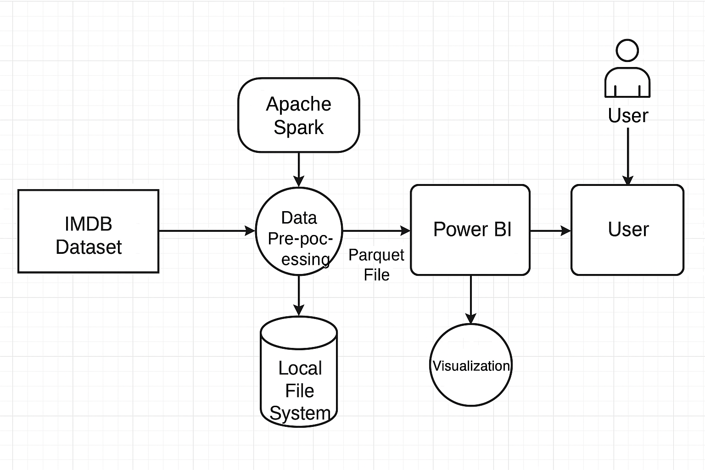

# AndreasIMDBProject

This repository holds files related to a self challenged project I have undertaken working with Big Data, using datasets from IMDB: https://developer.imdb.com/non-commercial-datasets/. (These files are too big to put in the repository so please download them from the link if you want to look at the raw data itself)

## Project Purpose
The Purpose is to create a dashboard to analyse the popularity of movies/actors, through the use of visualisations and tables which can be filtered by attributes such as year and genre.

​Additionally, this project allows me to familiarise myself with tools that might be used in a data-related job; Power BI and Apache Spark.

## Diagram

## Tasks/Tools used
Apache Spark was used to explore, pre-process and transform over 2,000,000 rows of data.

Then the transformed data is then loaded into Power BI to create visualisations and a table where users can query the data

## File Descriptions
**imdb testing.ipynb** is the python notebook file where I pre-processed the IMDB datasets.

**imdbparquettest.pbix** is the Power BI workbook where the popularity of movies is analysed, using data from the IMDB datesets.
